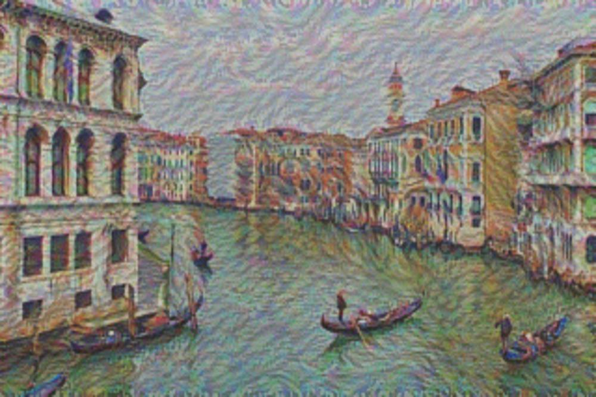
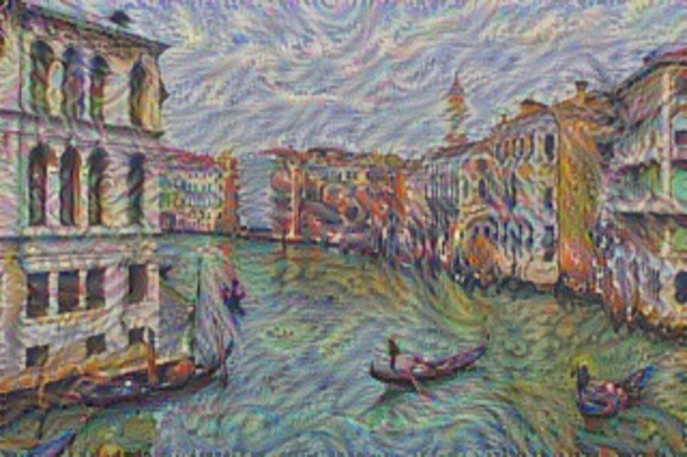
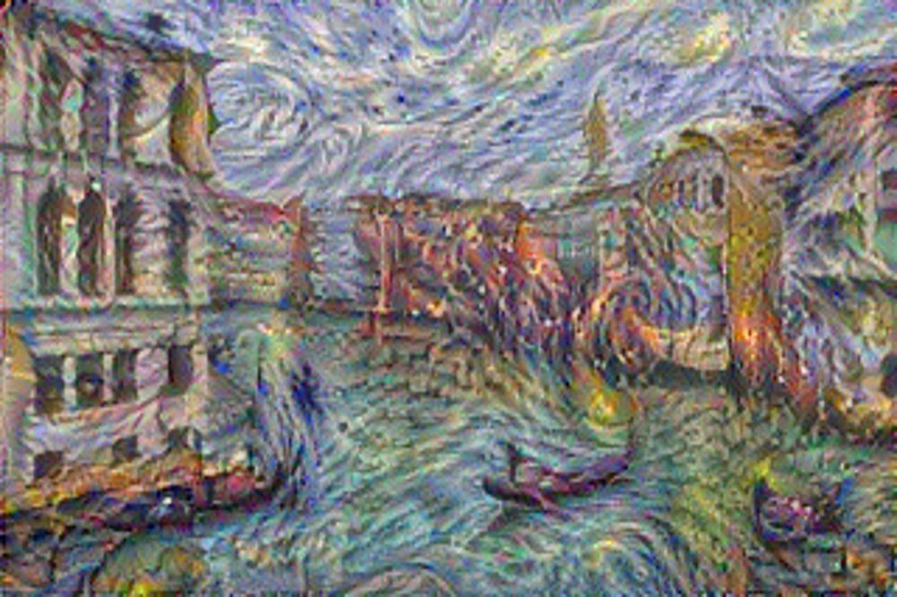
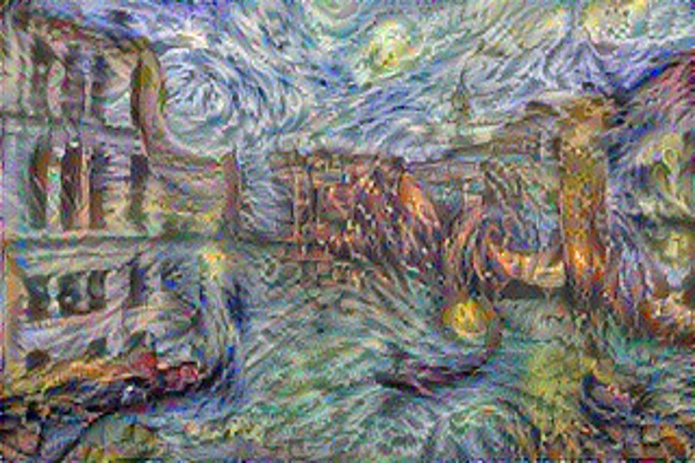
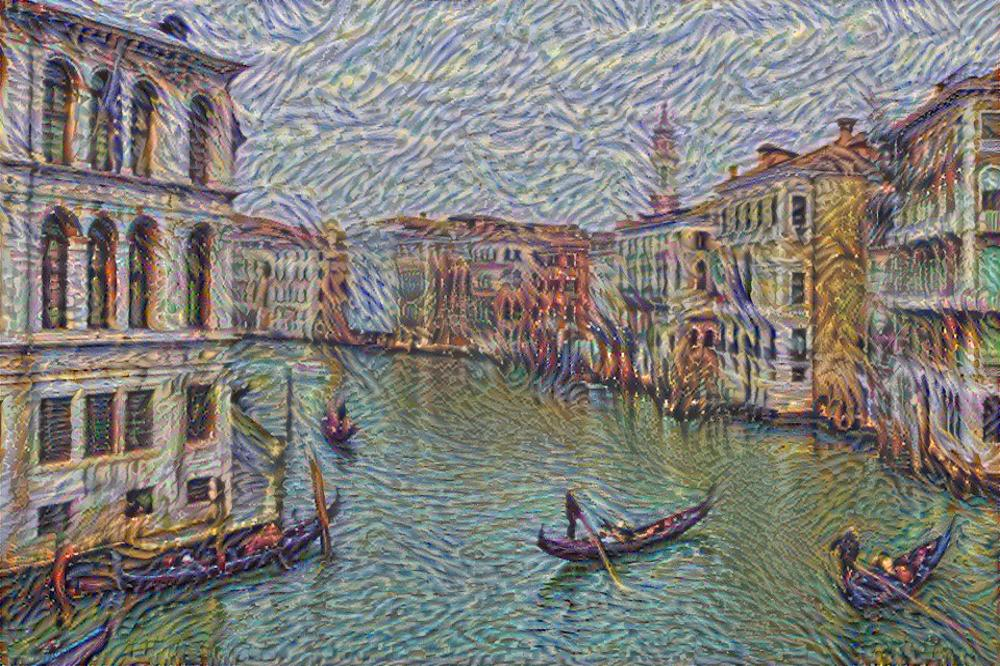

<div style='text-align:center; font-size:30px'>非实时图像风格迁移实验复现</div>

<div style="text-align:center; font-size:20px">
    ————智能计算系统第2次平时作业<p>
    学号：2112157		姓名：蔡鸿博
</div>

### 一、作业内容

阅读并学习[论文《A Nerual Algorithm of Artistic Style》](https://arxiv.org/abs/1508.06576)中所论述的实验方法，参考教材《智能计算系统》以及[实验指导手册](https://novel.ict.ac.cn/aics/wjxz/sywd/202206/P020220616365927600048.pdf)中的内容。完成教材第三章驱动范例（实验手册3.3非实时图像风格迁移）部分代码的理解和补全，完成非实时风格迁移实验复现，并编写实验报告。


### 二、实验环境

硬件环境：CPU
软件环境：Python编译环境及相关的扩展库


### 三、实验内容主体

利用VGG19网络实现非实时风格迁移。需要完成卷积层的实现和优化、最大池的实现和优化、内容损失层的前向传播与后向传播、风格损失层的前向传播和后向传播、Adam优化器的实现，通过调用卷积层、最大池、内容损失层与风格损失层，完成VGG19网络结构以及实现生成图像的更新。


### 四、代码填写

本次实验一共涉及到四个python文件的内容填写，main_exp_3_3.py、exp_3_3_style_transfer.py、layers_2.py、layers_3.py。

接下来按照实验内容主体顺序，依次进行汇报。

##### 卷积层的实现

本次实验中，卷积层的结构完全遵照VGG19网络结构，同时卷积层各层卷积核权重参数以及偏置参数均通过文件imagenet-vgg-verydeep-19.mat文件进行初始化，并且不再进行修改。因此，本次实验为了实现卷积层功能所涉及到的需要编写的代码函数，仅包括forward_raw与backward_raw函数中的TODO部分。

```python
def forward_raw(self, input):
    start_time = time.time()
    self.input = input # [N, C, H, W]
    height = self.input.shape[2] + self.padding * 2
    width = self.input.shape[3] + self.padding * 2
    self.input_pad = np.zeros([self.input.shape[0], self.input.shape[1], height, width])
    self.input_pad[:, :, self.padding:self.padding+self.input.shape[2], self.padding:self.padding+self.input.shape[3]] = self.input
    height_out = (height - self.kernel_size) // self.stride + 1
    width_out = (width - self.kernel_size) // self.stride + 1
    self.output = np.zeros([self.input.shape[0], self.channel_out, height_out, width_out])
    for idxn in range(self.input.shape[0]):
        for idxc in range(self.channel_out):
            for idxh in range(height_out):
                for idxw in range(width_out):
                    # TODO: 计算卷积层的前向传播，特征图与卷积核的内积再加偏置
                    self.output[idxn, idxc, idxh, idxw] = np.sum(self.input_pad[idxn, :, idxh*self.stride:idxh*self.stride+self.kernel_size, idxw*self.stride:idxw*self.stride+self.kernel_size] * self.weight[:, :, :, idxc]) + self.bias[idxc]
    self.forward_time = time.time() - start_time
    return self.output


def backward_raw(self, top_diff):
    start_time = time.time()
    self.d_weight = np.zeros(self.weight.shape)
    self.d_bias = np.zeros(self.bias.shape)
    bottom_diff = np.zeros(self.input_pad.shape)
    for idxn in range(top_diff.shape[0]):
        for idxc in range(top_diff.shape[1]):
            for idxh in range(top_diff.shape[2]):
                for idxw in range(top_diff.shape[3]):
                    # TODO： 计算卷积层的反向传播， 权重、偏置的梯度和本层损失
                    self.d_weight[:, :, :, idxc] += top_diff[idxn, idxc, idxh, idxw] * self.input_pad[idxn, :, idxh*self.stride:idxh*self.stride+self.kernel_size, idxw*self.stride:idxw*self.stride+self.kernel_size]
                    self.d_bias[idxc] += top_diff[idxn, idxc, idxh, idxw]
                    bottom_diff[idxn, :, idxh*self.stride:idxh*self.stride+self.kernel_size, idxw*self.stride:idxw*self.stride+self.kernel_size] += top_diff[idxn, idxc, idxh, idxw] * self.weight[:, :, :, idxc]
    bottom_diff = bottom_diff[:, :, self.padding:self.padding+self.input.shape[2], self.padding:self.padding+self.input.shape[3]]
    self.backward_time = time.time() - start_time
    return bottom_diff
```

在numpy中，\*运算表示对位相乘的哈达玛积运算，这十分符合卷积核进行卷积时的卷积操作运算。

因此在前向传播中，对于输出的每一个位置，通过卷积核与输入矩阵在映射的区间位置上求哈达玛积再求和，就可以得到该位置的对应数值。

而在反向传播中，根据梯度下降的公式计算梯度，可知
$$
\frac{\partial L}{\partial w} = X ,
\frac{\partial L}{\partial X} = w ,
\frac{\partial L}{\partial b} = 1
$$
故对于每一对idxn、idxc、idxh、idxw，有

```python
self.d_weight[:, :, :, idxc] += top_diff[idxn, idxc, idxh, idxw] * self.input_pad[idxn, :, idxh*self.stride:idxh*self.stride+self.kernel_size, idxw*self.stride:idxw*self.stride+self.kernel_size]
self.d_bias[idxc] += top_diff[idxn, idxc, idxh, idxw]
bottom_diff[idxn, :, idxh*self.stride:idxh*self.stride+self.kernel_size, idxw*self.stride:idxw*self.stride+self.kernel_size] += top_diff[idxn, idxc, idxh, idxw] * self.weight[:, :, :, idxc]
```

##### 卷积层的优化

卷积层的优化，主要依赖于将矩阵变形，或者说——向量化。在实验指导手册的第3.3.8小节延伸扩展部分，介绍了，将需要并行化的计算过程全部转变为向量化运算，在计算时Numpy会自动调用多个线程将向量化后的操作并行执行，依次通过Numpy实现并行化以提高卷积层运算效率的方法。

并且，实验指导手册中也详细地介绍了卷积层前向传播的优化方法的代码

```python
def forward_speedup(self, input):
    # TODO: 改进forward函数，使得计算加速
    start_time = time.time()
    self.input = input
    height = self.input.shape[2] + self.padding * 2
    width = self.input.shape[3] + self.padding * 2
    self.input_pad = np.zeros([self.input.shape[0], self.input.shape[1], height, width])
    self.input_pad[:, :, self.padding:self.padding+self.input.shape[2], self.padding:self.padding+self.input.shape[3]] = self.input
    self.height_out = (height - self.kernel_size) // self.stride + 1
    self.width_out = (width - self.kernel_size) // self.stride + 1
    self.weight_reshape = np.reshape(self.weight, [-1, self.channel_out])
    self.img2col = np.zeros([self.input.shape[0] * self.height_out * self.width_out, self.channel_in * self.kernel_size * self.kernel_size])
    for idxn in range(self.input.shape[0]):
        for idxh in range(self.height_out):
            for idxw in range(self.width_out):
                self.img2col[idxn*self.height_out*self.width_out+idxh*self.width_out+idxw, :] = self.input_pad[idxn, :, idxh*self.stride:idxh*self.stride+self.kernel_size, idxw*self.stride:idxw*self.stride+self.kernel_size].flatten()
    self.output = np.matmul(self.img2col, self.weight_reshape) + self.bias
    self.output = np.reshape(self.output, [self.input.shape[0], self.height_out, self.width_out, self.channel_out])
    self.output = np.transpose(self.output, [0, 3, 1, 2])
    self.forward_time = time.time() - start_time
    return self.output
```

这段代码可以实现优化的关键在于，将原本的四个for循环展开成了三个for循环，只需要通过三个for循环计算出img2col，这个变量的第一个维度，指明了图片的序号以及输出特征图的位置；第二个变量则是输出特征图位置所映射的输入特征图的区间。而通过矩阵乘法，img2col的第二维度数据与weight_reshap的第一个维度的数据运算，就相当于输入特征图的一组卷积核对一个位置卷积对位相乘再相加的结果。真的是十分巧妙的构造！

通过一个简单的矩阵乘法运算，就可以直接计算出输入特征图，只不过需要注意一下输出特征图的各个维度的先后顺序，调整过来以正确的格式将输出特征图返回。

同理，就可以得到backward_speedup函数的代码

```python
def backward_speedup(self, top_diff):
    start_time = time.time()
    top_diff = np.transpose(top_diff, [0, 2, 3, 1])
    top_diff_reshape = np.reshape(top_diff, [top_diff.shape[0] * top_diff.shape[1] * top_diff.shape[2], top_diff.shape[3]])
    self.d_weight_reshape = np.matmul(self.img2col.T, top_diff_reshape)
    self.d_bias = np.sum(top_diff, axis=(0, 2, 3))
    bottom_diff_reshape = np.matmul(top_diff_reshape, self.weight_reshape.T)
    bottom_diff = np.zeros([self.input.shape[0], self.input.shape[1], self.input_pad.shape[2], self.input_pad.shape[3]])
    for idxn in range(self.input.shape[0]):
        for idxh in range(self.height_out):
            for idxw in range(self.width_out):
                bottom_diff[idxn, :, idxh * self.stride:idxh * self.stride + self.kernel_size, idxw * self.stride:idxw * self.stride + self.kernel_size] += bottom_diff_reshape[idxn * self.height_out * self.width_out + idxh * self.width_out + idxw, :].reshape([self.channel_in, self.kernel_size, self.kernel_size])
    bottom_diff = bottom_diff[:, :, self.padding:self.padding + self.input.shape[2],
                  self.padding:self.padding + self.input.shape[3]]
    self.backward_time = time.time() - start_time
    return bottom_diff
```

想法是类似的，通过输出特征图的梯度和输入图像相乘可以得到权重的梯度，输出特征图的梯度进行求和得到偏置的梯度，输出特征图的梯度和权重相乘可以得到输入特征图的梯度。也同样，得到的输入特征图的梯度是一个和img2col结构类似的变量，需要通过三个for循环，变回输入特征图一般的结构。

##### 最大池化层的实现

在给出的代码模板的基础上，只需要完成forward_raw就可以实现最大池化层的基本功能。

```python
def forward_raw(self, input):
    start_time = time.time()
    self.input = input # [N, C, H, W]
    self.max_index = np.zeros(self.input.shape)
    height_out = (self.input.shape[2] - self.kernel_size) // self.stride + 1
    width_out = (self.input.shape[3] - self.kernel_size) // self.stride + 1
    self.output = np.zeros([self.input.shape[0], self.input.shape[1], height_out, width_out])
    for idxn in range(self.input.shape[0]):
        for idxc in range(self.input.shape[1]):
            for idxh in range(height_out):
                for idxw in range(width_out):
                    # TODO： 计算最大池化层的前向传播， 取池化窗口内的最大值
                    self.output[idxn, idxc, idxh, idxw] = np.max(self.input[idxn, idxc, idxh*self.stride:idxh*self.stride+self.kernel_size, idxw*self.stride:idxw*self.stride+self.kernel_size])
                    curren_max_index = np.argmax(self.input[idxn, idxc, idxh*self.stride:idxh*self.stride+self.kernel_size, idxw*self.stride:idxw*self.stride+self.kernel_size])
                    curren_max_index = np.unravel_index(curren_max_index, [self.kernel_size, self.kernel_size])
                    self.max_index[idxn, idxc, idxh*self.stride+curren_max_index[0], idxw*self.stride+curren_max_index[1]] = 1
    self.forward_time = time.time() - start_time
    return self.output
```

这里非常类似于卷积层，直接对每一组每一对idxn、idxc、idxh、idxw，直接用max函数获取到一个池化区域内的最大值，将其赋值给输出特征图的对应位置。

##### 最大池化层的优化

最大池化层在本次实验中消耗时间占比并不大，但为了尽可能提升效率，我还是补全了这一部分speedup函数，并且将VGG19中的所有池化层调用改为了调用优化函数进行前向传播和后向传播。

```python
def forward_speedup(self, input):
    # TODO: 改进forward函数，使得计算加速
    start_time = time.time()
    self.input = input
    height_out = (self.input.shape[2] - self.kernel_size) // self.stride + 1
    width_out = (self.input.shape[3] - self.kernel_size) // self.stride + 1
    self.output = np.zeros([self.input.shape[0], self.input.shape[1], height_out, width_out])
    self.img2col = np.zeros([self.input.shape[0] * height_out * width_out, self.input.shape[1] * self.kernel_size * self.kernel_size])
    self.max_index = np.zeros(self.img2col.shape)
    self.max_index = np.reshape(self.max_index, [self.input.shape[0] * height_out * width_out * self.input.shape[1], self.kernel_size * self.kernel_size])
    for idxn in range(self.input.shape[0]):
        for idxh in range(height_out):
            for idxw in range(width_out):
                self.img2col[idxn*height_out*width_out+idxh*width_out+idxw, :] = self.input[idxn, :, idxh*self.stride:idxh*self.stride+self.kernel_size, idxw*self.stride:idxw*self.stride+self.kernel_size].flatten()
    self.img2col = np.reshape(self.img2col, [self.input.shape[0] * height_out * width_out * self.input.shape[1], self.kernel_size * self.kernel_size])
    max_index = np.argmax(self.img2col, axis=1)
    self.max_index[np.arange(self.input.shape[0] * height_out * width_out * self.input.shape[1]), max_index] = 1
    self.img2col = np.reshape(self.img2col, [self.input.shape[0], height_out, width_out, self.input.shape[1], self.kernel_size * self.kernel_size])
    self.output = np.max(self.img2col, axis=4)
    self.output = np.transpose(self.output, [0, 3, 1, 2])
    self.forward_time = time.time() - start_time
    return self.output
```

仍然是先获取一个对应的img2col，它的结构和卷积层中是完全一致的。通过直接调用max函数就可以得到对应的输出特征图了，当然还是要注意一下矩阵的结构顺序。

而为了能够在backward_speedup中快速获取到取值的位置关系，通过max_index记录了最大值的位置，它的结构类似于img2col，只不过将对应最大值的位置替换为了1，其余部分均为0。为什么我要这样设置这个变量呢？因为在后向传播的过程中，输出特征图的一个梯度数值，只会影响到它对应的输入特征图区域中的最大值按个元素的梯度。而我只需要将输出特征图与这样一个max_index在对应位置上相乘，就可以得到一个类似于卷积层中bottom_diff_reshape的变量结果，参照卷积层可以很容易地完成这个优化（虽然做实验时捋这个逻辑真的废了不少功夫）。

```python
def backward_speedup(self, top_diff):
    # TODO: 改进backward函数，使得计算加速
    start_time = time.time()
    top_diff = np.transpose(top_diff, [0, 2, 3, 1])
    bottom_diff_reshape = top_diff.reshape([-1, 1]) * self.max_index
    bottom_diff_reshape = bottom_diff_reshape.reshape([top_diff.shape[0], top_diff.shape[1], top_diff.shape[2], top_diff.shape[3], self.kernel_size, self.kernel_size])
    bottom_diff = np.zeros(self.input.shape)
    for idxn in range(self.input.shape[0]):
        for idxh in range(self.input.shape[2] // self.stride):
            for idxw in range(self.input.shape[3] // self.stride):
                bottom_diff[idxn, :, idxh*self.stride:idxh*self.stride+self.kernel_size, idxw*self.stride:idxw*self.stride+self.kernel_size] += bottom_diff_reshape[idxn, idxh, idxw]
    self.backward_time = time.time() - start_time
    return bottom_diff
```

参照以上逻辑，就可以得到这个backward_speedup函数。

为了能够检验池化层的优化是否有效果，结果是否正确，我又适当修改了一下main_exp_3_3.py的test_speed_up函数，添加了对于池化层的测试，其中的

```python
test_dloss_max = np.random.rand(1, 256, 12, 20)
# 省略中间的卷积层测试代码
max = MaxPoolingLayer(2, 2)
stamp = time.time()
max_forward_result = max.forward(test_data)
max_forward_time = time.time()-stamp
print('max forward raw time: %f ms'%(max_forward_time*1000))
stamp = time.time()
max_backward_result = max.backward(test_dloss_max)
max_backward_time = time.time()-stamp
print('max backward raw time: %f ms'%(max_backward_time*1000))

speedup_max = MaxPoolingLayer(2, 2, 1)
stamp = time.time()
speedup_max_forward_result = speedup_max.forward(test_data)
speedup_max_forward_time = time.time()-stamp
print('max forward speedup time: %f ms'%(speedup_max_forward_time*1000))
stamp = time.time()
speedup_max_backward_result = speedup_max.backward(test_dloss_max)
speedup_max_backward_time = time.time()-stamp
print('max backward speedup time: %f ms'%(speedup_max_backward_time*1000))

speedup_max_forward_mse = computeMse(max_forward_result.flatten(), speedup_max_forward_result.flatten())
speedup_max_backward_mse = computeMse(max_backward_result.flatten(), speedup_max_backward_result.flatten())
if speedup_max_forward_mse < 0.003 and speedup_max_backward_mse < 0.003:
    print('SPEEDUP MAX TEST PASS.')
else:
    print('SPEEDUP MAX TEST FAILED.', speedup_max_forward_mse, speedup_max_backward_mse)
    # exit()

print('MAX FORWARD SPEEDUP RATIO: %f'%(max_forward_time / speedup_max_forward_time))
print('MAX BACKWARD SPEEDUP RATIO: %f'%(max_backward_time / speedup_max_backward_time))
```

这一测试验证是参照卷积层的测试补全的，逻辑也非常简单，并没有什么困难的地方。当然，也许你注意到了我将exit()函数进行了注释，很不幸的是，这里是因为我的测试并没有通过，计算得到的speedup_max_backward_mse大约等于0.06，我感觉这个误差应该无伤大雅，并且也确实不太清楚我的逻辑有什么问题，因此就直接用这部分代码进行了实验。

##### 内容损失层的实现

这里的代码，评价就是，套公式就得了，公式教材上有，论文里有，实验指导手册里也有，就不列出了

```python
def forward(self, input_layer, content_layer):
     # TODO： 计算风格迁移图像和目标内容图像的内容损失
    N, C, H, W = input_layer.shape
    loss = 1.0 / (2 * N * C * H * W) * np.sum(np.square(input_layer - content_layer))
    return loss
def backward(self, input_layer, content_layer):
    # TODO： 计算内容损失的反向传播
    N, C, H, W = input_layer.shape
    bottom_diff = 1.0 / (N * C * H * W) * (input_layer - content_layer)
    return bottom_diff
```

##### 风格损失层的实现

这里因为有代码模板，依然还是套公式，不过由于对python的逻辑不是十分清晰，这里做的我比较迷糊，当然直接看代码逻辑还是挺清晰的

```python
def forward(self, input_layer, style_layer):
    # TODO： 计算风格迁移图像和目标风格图像的Gram 矩阵
    style_layer_reshape = np.reshape(style_layer, [style_layer.shape[0], style_layer.shape[1], -1])
    self.gram_style = np.zeros([style_layer.shape[0], style_layer.shape[1], style_layer.shape[1]])
    self.input_layer_reshape = np.reshape(input_layer, [input_layer.shape[0], input_layer.shape[1], -1])
    self.gram_input = np.zeros([input_layer.shape[0], input_layer.shape[1], input_layer.shape[1]])
    for idxn in range(input_layer.shape[0]):
        self.gram_input[idxn, :, :] = np.matmul(self.input_layer_reshape[idxn, :, :], self.input_layer_reshape[idxn, :, :].T)
        self.gram_style[idxn, :, :] = np.matmul(style_layer_reshape[idxn, :, :], style_layer_reshape[idxn, :, :].T)
    M = input_layer.shape[2] * input_layer.shape[3]
    N = input_layer.shape[1]
    self.div = M * M * N * N
    # TODO： 计算风格迁移图像和目标风格图像的风格损失
    style_diff = np.sum(np.square(self.gram_input - self.gram_style))
    loss = 1.0 / (4 * input_layer.shape[0] * self.div) * style_diff
    return loss
def backward(self, input_layer, style_layer):
    bottom_diff = np.zeros([input_layer.shape[0], input_layer.shape[1], input_layer.shape[2]*input_layer.shape[3]])
    for idxn in range(input_layer.shape[0]):
        # TODO： 计算风格损失的反向传播
        bottom_diff[idxn, :, :] = 1.0 / (input_layer.shape[0] * self.div) * np.matmul(self.gram_input[idxn, :, :] - self.gram_style[idxn, :, :], self.input_layer_reshape[idxn, :, :])
    bottom_diff = np.reshape(bottom_diff, input_layer.shape)
    return bottom_diff
```

##### Adam优化器的实现

这里依然还是套公式，我自己也没理解这里是啥意思，反正套公式了

```python
def update(self, input, grad):
    # TODO：补全参数更新过程
    self.step += 1
    self.mt = self.beta1 * self.mt + (1 - self.beta1) * grad
    self.vt = self.beta2 * self.vt + (1 - self.beta2) * grad * grad
    mt_hat = self.mt / (1 - self.beta1 ** self.step)
    vt_hat = self.vt / (1 - self.beta2 ** self.step)
    # TODO： 利用梯度的一阶矩和二阶矩的无偏估计更新风格迁移图像
    output = input - self.lr * mt_hat / (np.sqrt(vt_hat) + self.eps)
    return output
```

##### VGG19网络结构

按照教材上VGG19网络结构，直接补全超参数就好

```python
def build_model(self):
    # TODO： 建立VGG19网络结构
    # 可以通过设置 type=1 来使用优化后的卷积和池化层，如 ConvolutionalLayer(3, 3, 64, 1, 1, type=1)
    print('Building vgg-19 model...')

    self.layers = {}
    self.layers['conv1_1'] = ConvolutionalLayer(3, 3, 64, 1, 1, type=1)
    self.layers['relu1_1'] = ReLULayer()
    self.layers['conv1_2'] = ConvolutionalLayer(3, 64, 64, 1, 1, type=1)
    self.layers['relu1_2'] = ReLULayer()
    self.layers['pool1'] = MaxPoolingLayer(2, 2, type=1)

    self.layers['conv2_1'] = ConvolutionalLayer(3, 64, 128, 1, 1, type=1)
    self.layers['relu2_1'] = ReLULayer()
    self.layers['conv2_2'] = ConvolutionalLayer(3, 128, 128, 1, 1, type=1)
    self.layers['relu2_2'] = ReLULayer()
    self.layers['pool2'] = MaxPoolingLayer(2, 2, type=1)

    self.layers['conv3_1'] = ConvolutionalLayer(3, 128, 256, 1, 1, type=1)
    self.layers['relu3_1'] = ReLULayer()
    self.layers['conv3_2'] = ConvolutionalLayer(3, 256, 256, 1, 1, type=1)
    self.layers['relu3_2'] = ReLULayer()
    self.layers['conv3_3'] = ConvolutionalLayer(3, 256, 256, 1, 1, type=1)
    self.layers['relu3_3'] = ReLULayer()
    self.layers['conv3_4'] = ConvolutionalLayer(3, 256, 256, 1, 1, type=1)
    self.layers['relu3_4'] = ReLULayer()
    self.layers['pool3'] = MaxPoolingLayer(2, 2, type=1)

    self.layers['conv4_1'] = ConvolutionalLayer(3, 256, 512, 1, 1, type=1)
    self.layers['relu4_1'] = ReLULayer()
    self.layers['conv4_2'] = ConvolutionalLayer(3, 512, 512, 1, 1, type=1)
    self.layers['relu4_2'] = ReLULayer()
    self.layers['conv4_3'] = ConvolutionalLayer(3, 512, 512, 1, 1, type=1)
    self.layers['relu4_3'] = ReLULayer()
    self.layers['conv4_4'] = ConvolutionalLayer(3, 512, 512, 1, 1, type=1)
    self.layers['relu4_4'] = ReLULayer()
    self.layers['pool4'] = MaxPoolingLayer(2, 2, type=1)

    self.layers['conv5_1'] = ConvolutionalLayer(3, 512, 512, 1, 1, type=1)
    self.layers['relu5_1'] = ReLULayer()
    self.layers['conv5_2'] = ConvolutionalLayer(3, 512, 512, 1, 1, type=1)
    self.layers['relu5_2'] = ReLULayer()
    self.layers['conv5_3'] = ConvolutionalLayer(3, 512, 512, 1, 1, type=1)
    self.layers['relu5_3'] = ReLULayer()

    self.layers['conv5_4'] = ConvolutionalLayer(3, 512, 512, 1, 1, type=1)
    self.layers['relu5_4'] = ReLULayer()
    self.layers['pool5'] = MaxPoolingLayer(2, 2, type=1)

    self.update_layer_list = []
    for layer_name in self.layers.keys():
        if 'conv' in layer_name:
            self.update_layer_list.append(layer_name)
```

而对于load_image、save_image、forward、backward函数，他们的逻辑都是非常简单直观的

```python
def load_image(self, image_dir, image_height, image_width):
    print('Loading and preprocessing image from ' + image_dir)
    # self.input_image = scipy.misc.imread(image_dir)
    self.input_image = imageio.imread(image_dir)
    image_shape = self.input_image.shape
    # self.input_image = scipy.misc.imresize(self.input_image,[image_height, image_width,3])
    self.input_image = np.array(Image.fromarray(self.input_image).resize((image_width, image_height)))
    self.input_image = np.array(self.input_image).astype(np.float32)
    self.input_image -= self.image_mean
    self.input_image = np.reshape(self.input_image, [1]+list(self.input_image.shape))
    # input dim [N, channel, height, width]
    # TODO: 调整输入数据的形状
    self.input_image = np.transpose(self.input_image, [0, 3, 1, 2])
    return self.input_image, image_shape

def save_image(self, input_image, image_shape, image_dir):
    #print('Save image at ' + image_dir)
    # TODO：调整输出图片的形状
    input_image = np.transpose(input_image, [0, 2, 3, 1])
    input_image = input_image[0] + self.image_mean
    input_image = np.clip(input_image, 0, 255).astype(np.uint8)
    # input_image = scipy.misc.imresize(input_image, image_shape)
    input_image = np.array(Image.fromarray(input_image).resize((image_shape[1], image_shape[0])))
    # scipy.misc.imsave(image_dir, input_image)
    imageio.imwrite(image_dir, input_image)

def forward(self, input_image, layer_list):
    start_time = time.time()
    current = input_image
    layer_forward = {}
    for idx in range(len(self.param_layer_name)):
        #print('Inferencing layer: ' + self.param_layer_name[idx])
        # TODO： 计算VGG19网络的前向传播
        current = self.layers[self.param_layer_name[idx]].forward(current)
        if self.param_layer_name[idx] in layer_list:
            layer_forward[self.param_layer_name[idx]] = current
    #print('Forward time: %f' % (time.time()-start_time))
    return layer_forward

def backward(self, dloss, layer_name):
    start_time = time.time()
    layer_idx = list.index(self.param_layer_name, layer_name)
    for idx in range(layer_idx, -1, -1):
        # TODO： 计算VGG19网络的反向传播
        dloss = self.layers[self.param_layer_name[idx]].backward(dloss)
    #print('Backward time: %f' % (time.time()-start_time))
    return dloss
```

除了正常需要补全的TODO，这里因为我是使用自己的电脑运行的程序，scipy库版本比较新已经启用了部分函数，因此对原本的模板进行了一些修改。

##### 损失计算和图像更新

在main函数中，也需要补全一定的函数来完成内容损失的前向传播和后向传播、风格损失的前向传播和后向传播、以及Adam优化器的更新。因为这一部分实质上是对函数的调用，也没有什么逻辑上的问题，也就不详细说了

```python
start = time.time()
for step in range(TRAIN_STEP):
    transfer_layers = vgg.forward(transfer_image, CONTENT_LOSS_LAYERS + STYLE_LOSS_LAYERS)
    content_loss = np.array([])
    style_loss = np.array([])
    content_diff = np.zeros(transfer_image.shape)
    style_diff = np.zeros(transfer_image.shape)
    for layer in CONTENT_LOSS_LAYERS:
        # TODO： 计算内容损失的前向传播
        current_loss = content_loss_layer.forward(transfer_layers[layer], content_layers[layer])
        content_loss = np.append(content_loss, current_loss)
        # TODO： 计算内容损失的反向传播
        dloss = content_loss_layer.backward(transfer_layers[layer], content_layers[layer])
        content_diff += vgg.backward(dloss, layer)
    for layer in STYLE_LOSS_LAYERS:
        # TODO： 计算风格损失的前向传播
        current_loss = style_loss_layer.forward(transfer_layers[layer], style_layers[layer])
        style_loss = np.append(style_loss, current_loss)
        # TODO： 计算风格损失的反向传播
        dloss = style_loss_layer.backward(transfer_layers[layer], style_layers[layer])
        style_diff += vgg.backward(dloss, layer)
    total_loss = ALPHA * np.mean(content_loss) + BETA * np.mean(style_loss)
    image_diff = ALPHA * content_diff / len(CONTENT_LOSS_LAYERS) + BETA * style_diff / len(STYLE_LOSS_LAYERS)
    # TODO： 利用Adam优化器对风格迁移图像进行更新
    transfer_image = adam_optimizer.update(transfer_image, image_diff)
    if step % 1 == 0:
        print('Step %d, loss = %f' % (step, total_loss), content_loss, style_loss)
        print('cost time: %f'%(time.time() - start))
        vgg.save_image(transfer_image, content_shape, 'output/output_' + str(step) + '.jpg')
        start = time.time()
```

### 五、结果分析

简单来做一个结果分析吧

##### 迭代次数的影响

α=1	β=500	lr=1.0	step=20



α=1	β=500	lr=1.0	step=99



以上两图对比可以看出，随着迭代次数的提高，输出的图像还是有一定差异的，如果看step=0时输出的图像，可以很明显发现，图像相比较原图仅仅只是由于分辨率压缩造成的模糊，而风格的变化几乎体现不出来、因此，随着迭代次数的增加，图像的风格特征会趋近显著，最终应该会逐渐收敛为某个损失函数的极小值位置。

##### α与β的比值的影响

α=1	β=500	lr=1.0	step=99


α=1	β=50000	lr=1.0	step=99


α=1	β=5000000	lr=1.0	step=99


能感觉到有一定差距，但不仔细看又看不太出差异来。但根据公式介绍，随着β的增大，图像应该向风格相似的方向更加逼近才对，这里只能先归结于迭代次数不足以及学习率过小造成的影响了

##### 学习率的影响

α=1	β=500	lr=1.0	step=99


α=1	β=500	lr=5.0	step=99



α=1	β=500	lr=10.0	step=99



这三张图像的差异还算是比较明显的了吧，可以看出学习率越大，图像的风格就越显著。学习率越大，理论上，相同迭代次数对图像进行的更改越大。由于本次实验中VGG中的参数都是不更新的，因此可以认为学习率的提升，使得图像梯度较为激进的对图像进行更新，但由于参数不发生改变，梯度的方向应该不会有什么严重的影响，所以大概就相当于迭代次数的提高。

我也简单尝试了一下lr=100时的图像，由于梯度过分的更新生成图像，导致生成的图像完全无法认出内容。

##### 卷积层和池化层优化效果


我这里直接让程序运行完test_speed_up后推出了，可以看到优化的效果还是不错的，卷积层有几百倍的效率提升，而池化层有几十倍的效率提升

最后再附上一个高分辨率的输出图像吧，看着比糊成一片的效果好很多，但训练的太慢了


